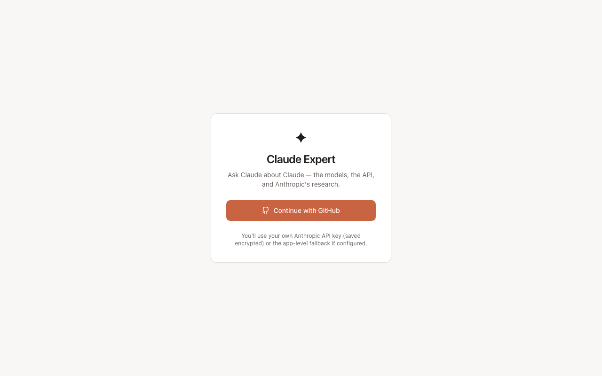
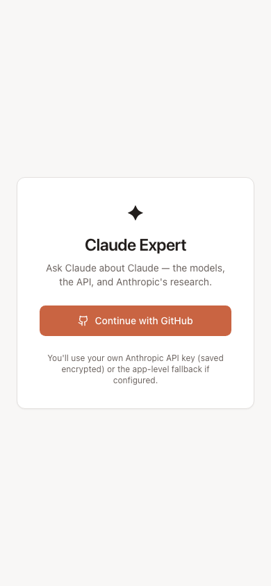

# Claude Expert

A chat-based Progressive Web App where you ask Claude about Claude — the
models, the API, the research, the products. Built with Next.js 14, TypeScript,
Prisma, NextAuth, and the Anthropic AI SDK.

> Portfolio project by [@jaronwright](https://github.com/jaronwright). See
> [CLAUDE.md](./CLAUDE.md) for architecture notes.


## Screenshots



<p align="center">
  
</p>

## Features

- 💬 **Streaming chat** via `@ai-sdk/anthropic`
- 🧠 **Claude Expert system prompt** covering model lineup, API features,
  prompting best practices, and alignment research, with inline links to
  real `docs.anthropic.com` URLs
- 🔐 **Per-user encrypted API keys** (AES-256-GCM) with an app-level fallback
- 🔑 **GitHub OAuth** via NextAuth + Prisma adapter
- 📱 **Installable PWA** — manifest + offline-capable service worker
- 🧩 **Model selector** — Opus 4.7 / Sonnet 4.6 / Haiku 4.5

## Quick start

```bash
npm install
cp .env.example .env  # fill in values — see below
npx prisma db push
npm run dev
```

Required env vars (see `.env.example` for generation commands):

- `NEXTAUTH_SECRET` — `openssl rand -base64 32`
- `ENCRYPTION_KEY` — `openssl rand -base64 32`
- `GITHUB_CLIENT_ID` / `GITHUB_CLIENT_SECRET` — from
  https://github.com/settings/developers
- `ANTHROPIC_API_KEY` — optional; users can paste their own key in settings

## Stack

- **Next.js 14** (App Router, RSC + streaming route handler)
- **TypeScript strict** — `noUncheckedIndexedAccess`, `noImplicitOverride`
- **Tailwind CSS** with shadcn-style primitives
- **Prisma** on SQLite (Postgres-ready — change one line to deploy)
- **NextAuth.js** with database sessions
- **`ai` + `@ai-sdk/anthropic`** for streaming
- **next-pwa** for the service worker and manifest wiring

## License

MIT
